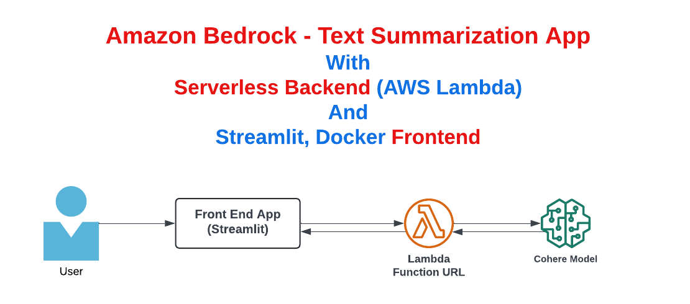

# Text Summarization - Generative AI Application [Hands-On]
## Built Using Amazon Bedrock - Cohere FM, Lambda, Python, Docker, Streamlit
## Models used:
    Cohere FM (Foundation Model)

## Introduction
In this video, we will implement a text summarization application. This application has both backend and frontend.

## Architecture

## Backend Application:
  The backend application is built using Serverless Technologies like AWS Lambda and and exposed as Lambda Function URL.
  The python lambda integrates with Bedrock to generate the response from LLM, which is Cohere Foundation Model in this case.

## Frontend Application
  The frontend is implemented using Python, Docker and Streamlit. An api call is made to the lambda function url with user's entered text.
  The response is displayed to the user as streaming text.

### Docker Commands:

  Build Docker Image:
  `docker build -t serverless-text-summarization-frontend .`

  Run Frontend application:
  `docker run -p 8082:8082 -it serverless-text-summarization-frontend`

